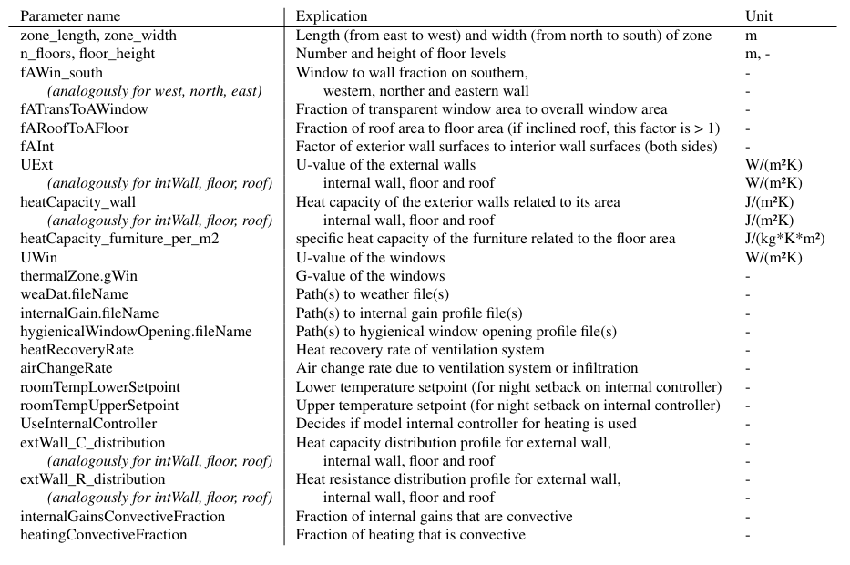

# Setup

## Important License Note

Currently, the FMU is missing in the repository due to open licencing questions. Thus, the programm is not properly executable right now. The repository will be updated with the FMU as soon as the licencing questions are answered. We hope that we can provide the full functionality of BuilDa as soon as possible. 

## Load Repository
To setup BuilDa clone the repo and go into the directory


```bash
git clone https://github.com/fabianraisch/BuilDa.git
cd BuilDa
```


## Create conda environment
Setup conda environment using the conda_env.yml  

```bash 
conda env create -f conda_env.yml
```
Activate the created conda environment
```bash
conda activate BuilDa
```


# Getting started
In the base directory execute  

```bash
python3 ./main.py
```

Optionally set parameters for FMU-File, configuration file and output directory to use (order of arguments doesn't matter)  

```bash
python3 ./main.py <my_model>.fmu <my_config>.json <my_output_folder>
```

If no command line parameters are set, parameters from main.py's user_config dictionary are used.

# Configuration of simulations
The configuration of the simulations as well as the buildings to be simulated is done in a json-file located in resources/configurations.  
## Variation of parameters
In the variations section of the config file, the parameters of the model itself can be set. There can be set more than one value per parameter by listing the values in brackets. With at least one parameter with multiple values, a simulation series is defined, indicating that there will be executed more than one simulation. There are generally two different methods to handle multiple parameters with more than one value set:

**zip variation:** The values are used for the parameters consecutivelly for each simulation of the simulation series. The longest value set determines the number of simulations. To create the final parameter value sets the last values of shorter value sets from other parameters are used. This method can be used if e.g. 10 different simulations should be executed, without combining each value with each other.

Example: 

```
zone_length: [5, 10], zone_width: [4, 8], floor_height: [2.5]
```

Resulting parameter sets: 

	zone_length: 5, zone_width:4, floor_height: 2.5
	zone_length: 10, zone_height:8, floor_height: 2.5

**cartesion product variation:** simulations with every possible configuration using the configured value sets

Example: 

`zone_length: [5, 10], zone_width=[4, 8], floor_height: [2.5]`

Resulting parameter sets:

	zone_length: 5, zone_width:4, floor_height: 2.5
	zone_length: 5, zone_width:8, floor_height: 2.5
	zone_length: 10, zone_width:4, floor_height: 2.5
	zone_length: 10, zone_width:8, floor_height: 2.5


## Model parameters (section variations)

The model parameters to be varied are located in the variations section of the configuration file. These include mainly building properties like
- zone dimensions like zone length, width, and floor height
- component properties like heat capacity and heat resistance (expressed by U-value) for external walls, internal walls, roof, and floor
- component resistance and capacity distribution, allowing for the configuration of inhomogeneous components
- quality of windows including solar heat gain coefficient and their U-value

but as well parameters allowing for the loading of external data about user behavior and weather, and parameters affecting the heating system and controller.
A list of the parameters is shown in the following table.





## General simulation parameters
The general simulation parameters include
- Variation type (**zip** or **cartesion_product**)
- Simulation start time  
- Simulation stop time
- External controllers to be used  
- Output columns  
- Time steps for:  
        - Simulation output  
        - External control  

# Simulation output
There are plenty of simulation output parameters (configurable as output parameters in the config JSON), with the most important being:

| Variable Name                          | Description                                                                                         | Unit        |
|----------------------------------------|-----------------------------------------------------------------------------------------------------|-------------|
| `thermalZone.TAir`                    | Zone air temperature                                                                                | K           |
| `totalHeatingPower.y`                  | Heating power emitted by the heating system                                                         | W           |
| `totalHeatingPowerWithGain.y`          | Heating power emitted by the heating system and internal heat gains by persons or electric devices (if configured) | W           |
| `weaBus.TDryBul`                       | Outside temperature                                                                                 | K           |
| `weaBus.HDirNor`                       | Normal direct solar radiation                                                                        | W/m²        |
| `weaDat.weaBus.HGloHor`                | Global horizontal solar radiation                                                                    | W/m²        |
| `weaBus.HDifHor`                       | Diffuse horizontal solar radiation                                                                   | W/m²        |
| `ventilationHeatLosses.Q_flow`        | Ventilation heat losses (including natural and mechanical ventilation)                               | W           |
| `Q_heating_MWh.y`                      | Total heat emitted during the simulation period by the heating system                               | MWh         |


# About the use of custom FMUs
## Introduction FMU
The provided FMUs are binary, platform-dependent files that execute the building model they contain. FMU parameters can generally be configured by writing them into the config JSON. To simplify model configuration, a converter layer has been implemented, allowing users to configure only basic parameters while more complex calculations are handled within converter functions. Consequently, only a limited number of parameters in the config JSON are intended to be passed directly to the FMU, while the majority are utilized to compute the actual FMU parameters through the converter functions.

## Use of custom FMUs
Advanced users wishing to implement a custom FMU generated from a specific model must ensure that the parameterization in the config JSON and the associated converter functions produce outputs (variable names and values) compatible with the FMU. If this compatibility is not established, proper model configuration cannot be guaranteed. It is essential that every parameter the user intends to modify in the FMU is accurately named, whether in the model itself, the config JSON, or the converter functions.

***Example:***  In our version of BuilDa, there are the configuration parameters `zone_length` and `zone_width` that are needed by the converter function `Zone_dimensions_calculator` to calculate `thermalZone.VAir` (zone volume), `thermalZone.AFloor` (zone floor area), and a lot more parameters used to configure the model. If in a new, custom FMU the length and width of the zone must be set in the model itself, the converter function `Zone_dimensions_calculator` is not needed anymore. Instead, the zone length and zone width could be set with their respective parameter names and values directly in the config JSON.

## Ensure compatibility with external controllers
External controller classes utilize model input and output parameter names configured as strings. To ensure compatibility, the model must provide the desired inputs and outputs with matching names. Alternatively, the controllers may need to be parameterized accordingly.

# About the use of custom controllers
## Controller input and controller output parameters
External controller classes must utilize proper model input and output parameter names configured as strings. While the developer of a controller class is relativelly free in choosing the controller input parameter as model variable, the controller output parameter must correspond to a model parameter where the value can be set during the simulation. For now, the following input parameters are implemented in the model (equals usable controler output parameters):

| Name                       | Range | Explanation                                                                |
|----------------------------|-------|----------------------------------------------------------------------------|
| `ctrSignalHeating`           | 0-1   | Control signal for heating                                                 |
| `ctrSignalCooling`           | 0-1   | Control signal for cooling                                                 |
| `ctrSignalWindowOpening`     | 0-1   | Control signal for window opening (influences air exchange and thus, zone temperature change) |

## Structure of a controller class
A newly created, custom controller class should always inherit from the `Controller` base class or one of their child classes.
Standard class parameters are:


| Variable Name      | Explanation                                         |
|--------------------|-----------------------------------------------------|
| `parameters_y`     | Controller input parameters                          |
| `parameters_u`     | Controller output parameters                         |
| `parameters_etc`   | Other model variables used to calculate controller output |
| `w`                | Setpoint                                            |
| `u_max`            | Upper limit for controller output                   |
| `u_min`            | Lower limit for controller output                   |

There must be always a `control` function in the controller class that accepts two parameters: a name-value dictionary representing the current FMU state (which includes at least the necessary FMU variables configured in the parameters of the controller class) and the current simulation time (essential for PI-Controllers to compute the integral).

The purpose of the control function is to modify the controller output variable within the FMU state dictionary and return the updated dictionary. The update of the FMU parameter values is then handled by BuilDa.

# Annotations
- If model internal heating controller is activated in the config JSON, the external heating controllers are not loaded. Criterion for external heating controller: output is `ctrSignalHeating` (heating controller interface of fmu)
- If more than one controller generates output for the same model interface, the output of the last controller configured in the controller ist in the configuration JSON is applied.


### License

This project is licensed under the GNU GENERAL PUBLIC LICENSE
                       Version 3 - see the [LICENSE](./LICENSE) file for details.


### Citation
This code is based on the publication **BUILDA: A THERMAL BUILDING DATA GENERATION FRAMEWORK FOR
TRANSFER LEARNING**.

For citation please use:  

```
@inproceedings{
    BuilDa2025,
    title={BUILDA: A THERMAL BUILDING DATA GENERATION FRAMEWORK FOR TRANSFER LEARNING},
    author={Thomas Krug and Fabian Raisch and Dominik Aimer and Markus Wirnsberger and Ferdinand Sigg and Benjamin Schäfer and Benjamin Tischler},
    year= {2025}
}
```